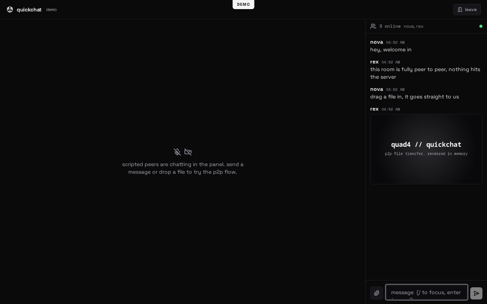

# quickchat

Ephemeral chat rooms with LiveKit voice and video. One Go binary serves
the React web client, a websocket for presence and WebRTC signaling, and
mints LiveKit access tokens. Chat messages and file transfers go peer to
peer over WebRTC data channels and never touch the server. SQLite keeps
room ids and timestamps only.

A scripted client-only demo runs at `/demo` (no server needed) and is
published to GitHub Pages on every web change.

## Run

    docker compose up -d          # traefik + app + livekit, needs .env

`.env`:

    QUICKCHAT_DOMAIN=chat.example.com   # app at https://chat.example.com
                                        # livekit at wss://lk.chat.example.com
    ACME_EMAIL=you@example.com
    LIVEKIT_API_KEY=devkey
    LIVEKIT_API_SECRET=at-least-32-characters-long-secret

Open these ports on the host firewall for LiveKit media: 7881/tcp,
7882/udp (plus 80/443 for the proxy). On a LAN or overlay network where
the host ip is reachable directly, set `LIVEKIT_USE_EXTERNAL_IP=false`
and `LIVEKIT_NODE_IP=<host ip>`.

or from source:

    make build                    # vite build + go build to bin/quickchat
    LIVEKIT_URL=wss://livekit.example.com \
    LIVEKIT_API_KEY=devkey \
    LIVEKIT_API_SECRET=secret \
    ./bin/quickchat

Open http://localhost:8080. API docs live at /docs.

## Privacy model

- The server stores room ids and creation timestamps only.
- Chat, typing and files flow over RTCDataChannel between browsers.
  Data channels are DTLS encrypted end to end.
- Files are chunked in memory at both ends. Nothing is written to disk
  or logged beyond the request log.
- Room links carry the media encryption key in the URL fragment
  (#e2ee=...). The key never reaches the server, so LiveKit media is
  end-to-end encrypted between participants.

## Configuration

Env only. Defaults shown:

    QUICKCHAT_ADDR=:8080            listen address
    QUICKCHAT_DATA=./data           sqlite room metadata
    QUICKCHAT_ROOM_TTL=168h         room expiry (7d)
    QUICKCHAT_MAX_FILE=67108864     p2p file transfer limit (64 MiB)
    QUICKCHAT_ICE_SERVERS=          comma separated stun/turn urls
    QUICKCHAT_RATE_CREATE=12        room creates per minute per ip
    QUICKCHAT_RATE_ACTION=60        token mints per minute per ip
    QUICKCHAT_RATE_SOCKET=30        ws connects per minute per ip
    QUICKCHAT_PPROF=                pprof listen address, off when empty
    QUICKCHAT_TRUSTED_PROXY=        trust X-Forwarded-For from the proxy
    LIVEKIT_URL=                    wss:// endpoint for the client
    LIVEKIT_API_KEY=
    LIVEKIT_API_SECRET=

Without the LIVEKIT_* variables the app still runs, voice and video are
disabled and the room falls back to chat only.

## Networking

The p2p mesh negotiates ICE between browsers:

- LAN or overlay networks (Tailscale, WireGuard, Netbird) work with zero
  configuration since peers reach each other on host candidates.
- Across the open internet, set QUICKCHAT_ICE_SERVERS to a STUN server,
  for example `stun:stun.l.google.com:19302`, and to a TURN server for
  restrictive NATs: `turn:turn.example.com:3478?transport=udp`.
- TURN relays see packet metadata and carry the traffic, but payloads
  stay DTLS encrypted. Prefer direct paths when privacy matters.

## Deploy

- `docker-compose.yml`: all in one stack. Traefik terminates TLS for
  the app and for LiveKit signaling on `lk.<domain>`; media uses
  7881/tcp and 7882/udp directly.
- `docker-compose.coolify.yml`: same two services for Coolify's docker
  compose build pack. Assign a domain to quickchat (port 8080) and one
  to livekit (port 7880), then set `LIVEKIT_URL` to the livekit domain.
  Publish 7881/tcp and 7882/udp for media.
- Published images land at `ghcr.io/quad4-software/quickchat`, signed
  keyless with cosign and attested with SBOM and provenance.

## Develop

    make dev          # backend on :8080
    pnpm -C web dev   # vite dev server, proxies /api and /ws
    make test         # go tests incl. race + vitest
    make test-e2e     # playwright + axe against the real binary
    make check        # gofmt, vet, golangci-lint, eslint, prettier, tsc
    pnpm -C web lhci  # lighthouse, gates at 100

License: 0BSD.
